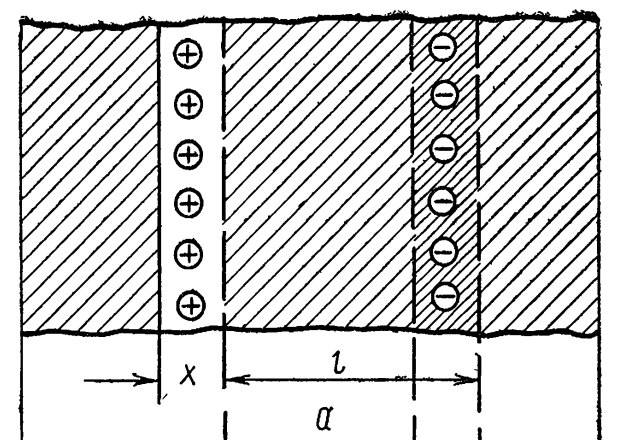

# Понятие плазмы. Квазинейтральность. Плазменная частота.

## Определение плазмы
Под плазмой будем понимать смесь частиц, которые не является свободными, в силу того, что на них  
воздействую электромагнитные поля, создаваемые другими заряженными частицами.  
Однако можно называть частицы свободными, чтобы подчеркнуть, что они не связаны в атомы и молекулы.

## Квазинейтральность
Термин подразумевает, что суммарный заряд ансамбля частиц равен нулю только на больших масштабах в  
пространстве и времени. В микроскопическом приближении возможны значительные флуктуации полного заряда.  
Математически данный факт можно записать в виде следующего выражения:
$$\sum_{\alpha}^{N}Z_{\alpha} n_{\alpha} = 0$$

## Плазменная частота
Представим, что у нас имеется нейтральная плазма, характеризуемая коцентрацией $n_e$ и температурой $T_e$ электронов.  
Пусть произошло смещение плоского слоя электронов и нарушилась квазинейтральность:

Электрическое поле между данными слоями будет эквивалентно электрическому полю конденсатора:
$$E = \frac{n_e e \Delta x}{\epsilon_0}$$

Здесь $\Delta x = l$.  
Очевидно, что на слой электронов будет действовать возвращающая их сила $-eE$.  
Тогда запишем уравнение движения электронов:
$$m_e \frac{d^2 \Delta x}{dt^2} = -eE$$

Характерная частота такого движения:
$$\omega_p = \sqrt{\frac{e^2 n_e}{m_e \epsilon_0}}$$

Эта частота называется **плазменной** или **Ленгмюровской** частотой.  
Она определяет характерный временной масштаб, на котором нарушается квазинейтральность.